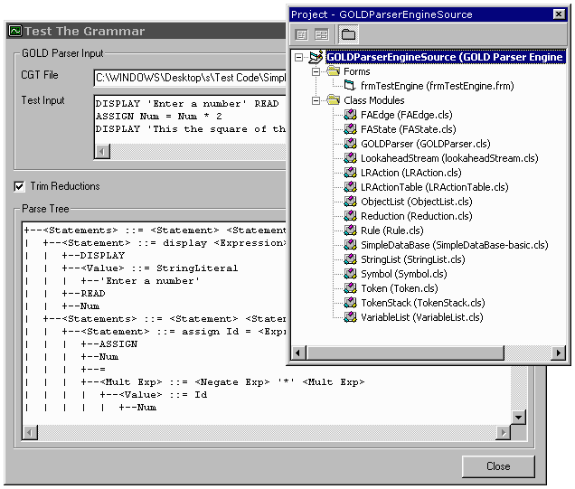



## GOLD Parser Engine Source Code

### Description

The GOLD Parser is a new, free parser generator that you can use to develop your own compilers and emulators. It strives to be a development tool that can be used with numerous programming languages and on multiple platforms while maintaining modern design concepts.

Modern bottom-up parsers use a Deterministic Finite Automaton (DFA) for identifying different classes of tokens and a LALR(1) state machine to parse them. The actual LALR(1) and DFA algorithms are easy to implement since they rely on tables to determine actions and state transition. Consequently, it is the computing of these tables that is both time-consuming and complex.

The GOLD Parser Builder performs this task; reading from a source grammar outline and then computing the appropriate tables. This information is then saved to a Compiled Grammar Table file which can be, subsequently, loaded by the actual parser engine and used.

NEW! The source code for the GOLD Parser Engine is finally available to download. The zip file contains the Visual Basic source code used to implement the ActiveX Engine. In other words, this code includes the DFA and LALR algorithms.

In the future, the source will be ported to as many programming languages as possible. If you would like to port the code to another language, your work will be deeply appreciated.

The parse tree sample project, I posted on Planet Source Code a couple weeks ago, is included with this download. This is a simple project which loads a Compiled Grammar Table file and draws a parse tree for a given input string. The project parses an example grammar called "Simple".

To download the GOLD Parser Builder, please visit http://www.DevinCook.com/GOLDParser

Enjoy, and happy programming!
 
### More Info
 

             |
---                |---
**Submitted On**   |2002-03-12 11:29:42
**By**             |[Devin Cook](https://github.com/Planet-Source-Code/PSCIndex/blob/master/ByAuthor/devin-cook.md)
**Level**          |Advanced
**User Rating**    |4.2 (25 globes from 6 users)
**Compatibility**  |VB 5\.0, VB 6\.0
**Category**       |[Miscellaneous](https://github.com/Planet-Source-Code/PSCIndex/blob/master/ByCategory/miscellaneous__1-1.md)
**World**          |[Visual Basic](https://github.com/Planet-Source-Code/PSCIndex/blob/master/ByWorld/visual-basic.md)
**Archive File**   |[GOLD\_Parse616363122002\.zip](https://github.com/Planet-Source-Code/devin-cook-gold-parser-engine-source-code__1-32593/archive/master.zip)

